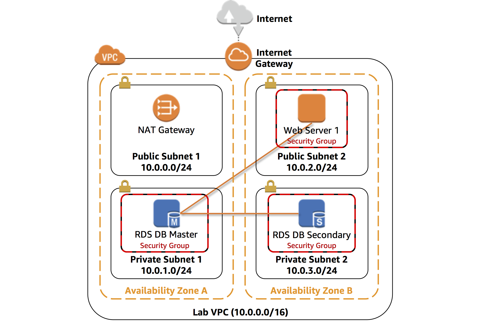

# Module 2: Add a Database to Your Infrastructure

This lab is designed to reinforce the concept of leveraging an AWS-managed database instance for solving relational database needs.

***Amazon Relational Database Service*** (Amazon RDS) makes it easy to set up, operate, and scale a relational database in the cloud. It provides cost-efficient and resizable capacity while managing time-consuming database administration tasks, which allows you to focus on your applications and business. Amazon RDS provides you with six familiar database engines to choose from: Amazon Aurora, Oracle, Microsoft SQL Server, PostgreSQL, MySQL and MariaDB.

&nbsp;

**Objectives**

After completing this lab, you can:

- Launch an Amazon RDS DB instance with high availability.
- Configure the DB instance to permit connections from your web server.
- Open a web application and interact with your database.

&nbsp;

**Duration**

This lab takes approximately **30 minutes**.

&nbsp;

**Scenario**

You start with the following infrastructure:

&nbsp;&nbsp;

At the end of the lab, this is the infrastructure:

&nbsp;

&nbsp;&nbsp;

## Task 1: Create a Security Group for the RDS DB Instance

In this task, you will create a security group to allow your web server to access your RDS DB instance. The security group will be used when you launch the database instance.

  
<strong>Step-by-step instructions (expand for details)</strong>

  

5. In the **AWS Management Console**, on the **Services** menu, click **VPC**.

6. In the left navigation pane, click **Security Groups**.

7. Click **Create security group** and then configure:

   - **Security group name:** `DB Security Group`
   - **Description:** `Permit access from Web Security Group`
   - **VPC:** _Lab VPC_

8. Click **Create** then click **Close**

    You will now add a rule to the security group to permit inbound database requests.

9. Select **DB Security Group**.

10. Click the **Inbound Rules** tab.

    The security group currently has no rules. You will add a rule to permit access from the _Web Security Group_.

11. Click **Edit rules**

12. Click **Add Rule** then configure:

    - **Type:** _MySQL/Aurora (3306)_
    - **CIDR, IP, Security Group or Prefix List:** Type `sg` and then select _Web Security Group_.

    This configures the Database security group to permit inbound traffic on port 3306 from any EC2 instance that is associated with the _Web Security Group_.

13. Click **Save rules** then click **Close**

    You will use this security group when launching the Amazon RDS database.
    
    

    

&nbsp;

___
## Task 2: Create a DB Subnet Group

In this task, you will create a _DB subnet group_ that is used to tell RDS which subnets can be used for the database. Each DB subnet group requires subnets in at least two Availability Zones.

  
<strong>Step-by-step instructions (expand for details)</strong>

  

1. On the **Services** menu, click **RDS**.

2. In the left navigation pane, click **Subnet groups**.

    If the navigation pane is not visible, click the <i class="fas fa-bars"></i> menu icon in the top-left corner.

3. Click Create DB Subnet Group then configure:

    - **Name:** `DB Subnet Group`
    - **Description:** `DB Subnet Group`
    - **VPC:** _Lab VPC_
    - **Availability zone:** Select the _first_ Availability Zone
    - **Subnet:** _10.0.1.0/24_
    - Click Add subnet

    This added Private Subnet 1. You will now add Private Subnet 2.

4. Configure these settings (on the existing screen):

    - **Availability zone:** Select the _second_ Availability Zone
    - **Subnet:** _10.0.3.0/24_
    - Click **Add subnet**

    These subnets should now be shown in the list: **10.0.1.0/24** and **10.0.3.0/24**

5. Click **Create**

    You will use this DB subnet group when creating the database in the next task.

&nbsp;
  

    
___
## Task 3: Create an Amazon RDS DB Instance

In this task, you will configure and launch a Multi-AZ Amazon RDS for MySQL database instance.

Amazon RDS ***Multi-AZ*** deployments provide enhanced availability and durability for Database (DB) instances, making them a natural fit for production database workloads. When you provision a Multi-AZ DB instance, Amazon RDS automatically creates a primary DB instance and synchronously replicates the data to a standby instance in a different Availability Zone (AZ).

  
<strong>Step-by-step instructions (expand for details)</strong>

  

1. In the left navigation pane, click **Databases**.

2. Click **Create database**

    If you see **Switch to the new database creation flow** at the top of the screen, please click it.

3. Select **MySQL**. (**Note: DO NOT SELECT AURORA**)

4. Under **Settings**, configure:

    - **DB instance identifier:** `lab-db`
    - **Master username:** `master`
    - **Master password:** `lab-password`
    - **Confirm password:** `lab-password`

5. Under **DB instance size**, configure:

     - Select **Burstable classes (includes t classes)**.
     - Select _db.t3.micro_

6. Under **Storage**, configure:

    - **Storage type:** _General Purpose (SSD)_
    - **Allocated storage:** _20_

7. Under **Connectivity**, configure:

    - **Virtual Private Cloud (VPC):** _Lab VPC_

8. Expand **Additional connectivity configuration**, then configure:

    - For **Existing VPC security groups:** click _DB Security Group_ to highlight it in blue.

9. Expand **Additional configuration**, then configure:

    - **Initial database name:** `lab`
    - Uncheck **Enable automatic backups**.
    - Uncheck **Enable Enhanced monitoring**.

    This will turn off backups, which is not normally recommended, but will make the database deploy faster for this lab.

10. Click **Create database**

    Your database will now be launched.

    If you receive an error that mentions "not authorized to perform: iam:CreateRole", make sure you unchecked _Enable Enhanced monitoring_ in the previous step.

11. Click **lab-db** (click the link itself).

    You will now need to wait **approximately 4 minutes** for the database to be available. The deployment process is deploying a database in two different Availability zones.

    While you are waiting, you might want to review the [Amazon RDS FAQs](https://aws.amazon.com/rds/faqs/) or grab a cup of coffee.

12. Wait until **Info** changes to **Modifying** or **Available**.

13. Scroll down to the **Connectivity & security** section and copy the **Endpoint** field.

    It will look similar to: _lab-db.cggq8lhnxvnv.us-west-2.rds.amazonaws.com_

14. Paste the Endpoint value into a text editor. You will use it later in the lab.

  

&nbsp;
___
## Task 4: Interact with Your Database

In this task, you will open a web application running on your web server and configure it to use the database.

  
<strong>Step-by-step instructions (expand for details)</strong>

  

1. To copy the **WebServer** IP address, click on the **Details** drop down menu above these instructions, and then click **Show**.

2. Open a new web browser tab, paste the _WebServer_ IP address and press Enter.

    The web application will be displayed, showing information about the EC2 instance.

3. Click the **RDS** link at the top of the page.

    You will now configure the application to connect to your database.

4. Configure the following settings:

    - **Endpoint:** Paste the Endpoint you copied to a text editor earlier
    - **Database:** `lab`
    - **Username:** `master`
    - **Password:** `lab-password`
    - Click **Submit**

    A message will appear explaining that the application is executing a command to copy information to the database. After a few seconds the application will display an **Address Book**.

    The Address Book application is using the RDS database to store information.

5. Test the web application by adding, editing and removing contacts.

    The data is being persisted to the database and is automatically replicating to the second Availability Zone.

