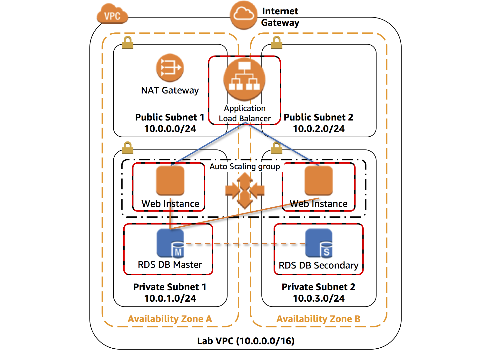
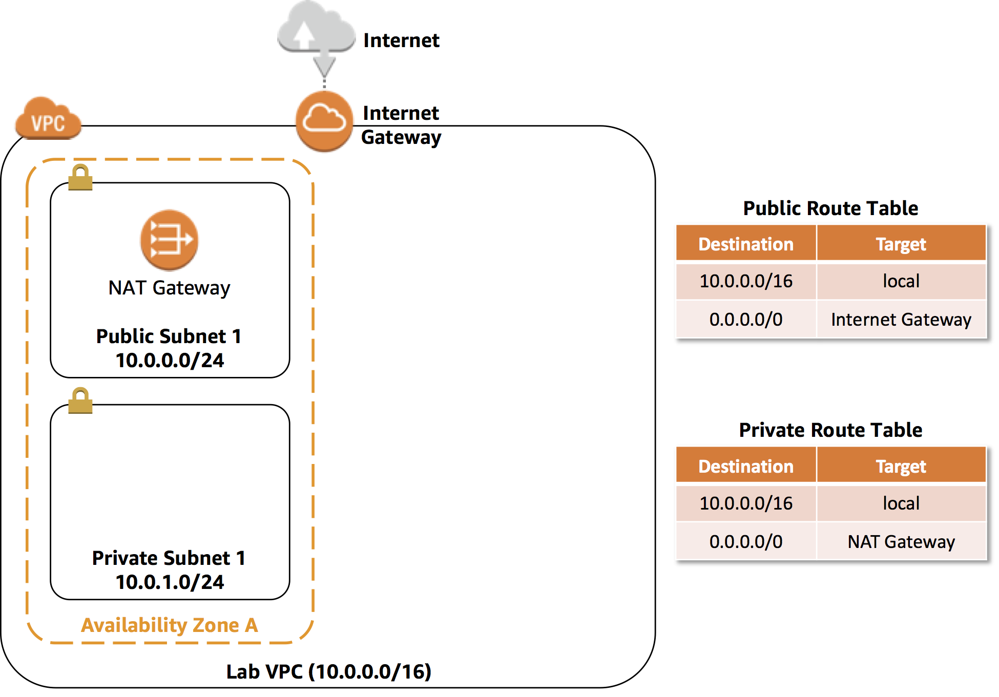
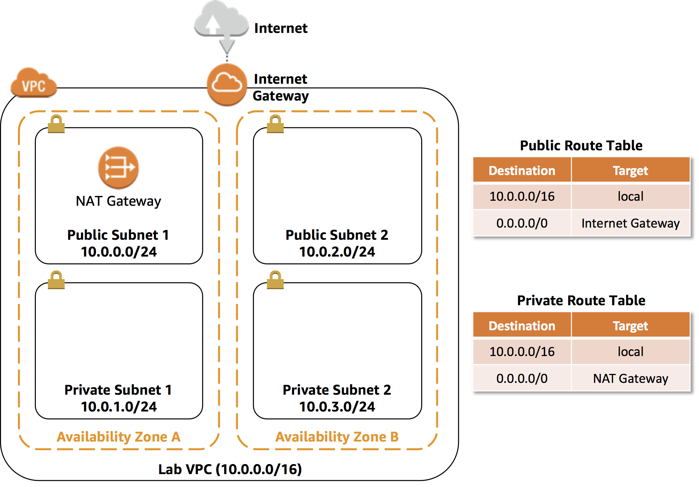

Module 1: Deploy a Network and Webapp on AWS
===

In this module, we'll walk through how to create an EC2 instance on AWS, 
and running a web server on it. 


## Solution Architecture

The architecture for this module is really simple --- we'll deploy a single EC2 instance
on AWS, and use that as a web server. All HTTP requests going into our web app will be
received and addressed by this EC2 instance.



Amazon EC2 instances need to be deployed into a VPC, in one of the network subnets 
configured inside. We'll use this characteristic to improve our application in the next module.
For now, just keep this in mind.

## Implementation Overview

Each of the following sections provides an implementation overview, as well as detailed
step-by-step instructions you can follow to complete the module. The overview should provide
enough context for you to complete the implementation if you're already familiar with
the AWS Management Console , or if you want to explore the services yourself
without following a walkthrough.

> **Note**: We'll just call the **AWS Management Console** as just the **console** from here on.

### Region Selection

If you're completing this module as part of a workshop or classroom setting, you will probably
have been given instructions on which AWS region to use. Please confirm this with your facilitator.

Otherwise, feel free to use any available region on the AWS Management Console.

Once you've chosen a region, you should use that region **for the entire workshop**. 

You can choose which region you're working in at the top-right corner menu of the AWS Management Console.


### 1. Create Your VPC

AWS gives you full control of your networking environment through the VPC service

#### High-level instructions
In this task, you will use the VPC Wizard to create a VPC an Internet Gateway and two subnets in a single Availability Zone. An Internet gateway (IGW) is a VPC component that allows communication between instances in your VPC and the Internet.

After creating a VPC, you can add subnets. Each subnet resides entirely within one Availability Zone and cannot span zones. If a subnet's traffic is routed to an Internet Gateway, the subnet is known as a public subnet. If a subnet does not have a route to the Internet gateway, the subnet is known as a private subnet.

The wizard will also create a NAT Gateway, which is used to provide internet connectivity to EC2 instances in the private subnets.


<details>
  <summary><strong>Step-by-step instructions (expand for details)</strong></summary>
  <p>
    
  1. In the AWS Management Console, on the ***Services** menu, click **VPC**.
  2. In the left navigation pane click **Elastic IP Addresses**
  3. Click **Allocate New Address**
  4. Click **Allocate**
  5. Click **Launch VPC Wizard**
  6. In the left navigation pane, click **VPC with Public and Private Subnets** (the second option).
  7. Click Select then configure:
      - **VPC name**: `Lab VPC`
      - **Availability Zone**: Select the *first* Availability Zone
      - **Public subnet name**: `Public Subnet 1`
      - **Availability Zone**: Select the *first* Availability Zone (the same as used above)
      - **Private subnet name**: `Private Subnet 1`
      - **Elastic IP Allocation ID**: Click in the box and select the displayed IP address
  8. Click **Create VPC**


  </p>
</details>

The wizard has provisioned a VPC with a public subnet and a private subnet in the same Availability Zone, together with route tables for each subnet:



### 2. Create Additional Subnets

In this task, you will create two additional subnets in a second Availability Zone. This is useful for creating resources in multiple Availability Zones to provide _High Availability_.

<details>
  <summary><strong>Step-by-step instructions (expand for details)</strong></summary>
  <p>

1. In the left navigation pane, click **Subnets**.

    First, you will create a second Public Subnet.

2. Click **Create subnet** then configure:

    - **Name tag:** `Public Subnet 2`
    - **VPC:** _Lab VPC_
    - **Availability Zone:** Select the *second* Availability Zone
    - **IPv4 CIDR block:** `10.0.2.0/24`

    The subnet will have all IP addresses starting with **10.0.2.x**.

3. Click **Create** then click **Close**

    You will now create a second Private Subnet.

4. Click **Create subnet** then configure:

    - **Name tag:** `Private Subnet 2`
    - **VPC:** _Lab VPC_
    - **Availability Zone:** Select the *second* Availability Zone
    - **CIDR block:** `10.0.3.0/24`

    The subnet will have all IP addresses starting with **10.0.3.x**.

5. Click **Create** then click **Close**

    You will now configure the Private Subnets to route internet-bound traffic to the NAT Gateway so that resources in the Private Subnet are able to connect to the Internet, while still keeping the resources private. This is done by configuring a _Route Table_.

    A *route table* contains a set of rules, called *routes*, that are used to determine where network traffic is directed. Each subnet in a VPC must be associated with a route table; the route table controls routing for the subnet.

6. In the left navigation pane, click **Route Tables**.

7. Select the route table with **Main = Yes** and **VPC = Lab VPC**. (Expand the _VPC ID_ column if necessary to view the VPC name.)

8. In the lower pane, click the **Routes** tab.

    Note that **Destination 0.0.0.0/0** is set to **Target nat-xxxxxxxx**. This means that traffic destined for the internet (0.0.0.0/0) will be sent to the NAT Gateway. The NAT Gateway will then forward the traffic to the internet.

    This route table is therefore being used to route traffic from Private Subnets. You will now add a name to the Route Table to make this easier to recognize in future.

9. In the **Name** column for this route table, click the pencil then type `Private Route Table` and click the check mark

10. In the lower pane, click the **Subnet Associations** tab.

    You will now associate this route table to the Private Subnets.

11. Click **Edit subnet associations**

12. Select both **Private Subnet 1** and **Private Subnet 2**.

     You can expand the _Subnet ID_ column to view the Subnet names.

13. Click **Save**

    You will now configure the Route Table that is used by the Public Subnets.

14. Select = the route table with **Main = No** and **VPC = Lab VPC** (and deselect any other subnets).

15. In the **Name** column for this route table, click the pencil then type `Public Route Table`, and tick the check mark

16. In the lower pane, click the **Routes** tab.

    Note that **Destination 0.0.0.0/0** is set to **Target igw-xxxxxxxx**, which is the Internet Gateway. This means that internet-bound traffic will be sent straight to the internet via the Internet Gateway.

    You will now associate this route table to the Public Subnets.

17. Click the **Subnet Associations** tab.

18. Click **Edit subnet associations**

19. Select both **Public Subnet 1** and **Public Subnet 2**.

20. Click **Save**


  </p>
</details>

Your VPC now has public and private subnets configured in two Availability Zones:



### 3. Create an EC2 instance

Amazon EC2 lets you create virtual machines on the AWS cloud. Once created, you can use
it as you would use most any other computer or virtual machine. For this module,
we'll create and prepare an EC2 instance to run a server we can use to host a website.

#### High-level instructions

Use the console or AWS CLI to create an Amazon EC2 `t3.micro` instance, using an `Amazon Linux 2` AMI.
Make sure that this instance is publicly accessible both for `SSH` and `HTTP`, and has an assigned public IPv4 address.

<details>
  <summary><strong>Step-by-step instructions (expand for details)</strong></summary>
  <p>
    
  1. In the console, choose **Services** at the top-left menu, and choose **EC2** under Compute.
    
  2. Click the *Launch Instance** button. This will start a step-by-step wizard for creating a new EC2 instance.
  3. In the `Step 1` screen: select an **Amazon Linux 2** AMI. 
  4. In the `Step 2` screen: select a `t3.micro` instance. 
  5. In the `Step 3` screen: make sure the following configuration is set:
     1. For `Network`, the VPC you created in the previous step is selected.
     2. Use `Public Subnet 2`
     3. For `Auto-assign public IP`, make sure this is enabled.
     4. Expand advanced details, and in the Userdata section, pase the following text:
     ```bash
     #!/bin/bash
     # Install Apache Web Server and PHP
     yum install -y httpd mysql php
     # Download Lab files
     wget https://us-west-2-tcprod.s3.amazonaws.com/courses/ILT-TF-100-TECESS/v4.6.8/lab-1-build-a-web-server/scripts/lab-app.zip
     unzip lab-app.zip -d /var/www/html/
     # Turn on web server
     chkconfig httpd on
     service httpd start
     ```
  6. In the `Step 4` screen: specify `10 GB` for the root volume.
  7. In the `Step 5` screen: add a **Name** to your instance.

  > **Note**: in a classroom setting, this will help identify your instance from others doing the same workshop.

  8. In the `Step 6` screen:
     1. Opt to create a new security group. **Important**: give your security group a unique name you'll remember.
     2. Add rules to allow `SSH` and `HTTP` from **anywhere** to your security group.
     3. Click **Next**.

  9. In the `Step 7` screen: confirm all your settings.
  10. A dialog box should appear. Opt to **create a new keypair**. Give your keypair a name, a download it to your machine. Take note of where you saved it.
  11. Click **Launch instance**.

  Your instance should be visible from the dashboard immediately, and will be ready for use in about 30 seconds.
  </p>
</details>

The complete architecture you deployed is:


### 4. Connect to your instance via SSH (Optional)

Linux-based instances allow you to SSH into them --- once an SSH connection has been established,
you can run commands from inside the machine, and effectively use the instance as if
it was right in front of you.

To establish an SSH connection, you will need the keypair you created in the previous step:
the private half of that key is what you downloaded, and the public half of it has been
baked into the EC2 instance. Only those who have a copy of the private key can connect
to it, so **keep your keyfiles in a safe place**!

#### High-level instructions

Establish an SSH connection to your EC2 instance. You will need to ensure that your keyfile
has `chmod 400` permissions.

<details>
  <summary><strong>Step-by-step instructions (click to expand):</strong></summary>
  <p>
    
  1. Locate the keyfile you downloaded in your computer. Optionally make sure it's in a directory that you can access easily.
    
  2. In your terminal, run `chmod 400 [keyfile]`, where `[keyfile]` is the path to your keyfile `PEM` file.
     Your EC2 instance will reject connections if it detects that your keyfile is too open to the world.

  ```
  e.g.

  chmod 400 ~/keys/my-keyfile.pem
  ```

  3. Locate your EC2 instance's **public IPv4 address** in your EC2 dashboard. It should be in the **Desription** tab when selected.
  4. To establish an SSH connection, run `ssh -i [your keyfile] ec2-user@[public IPv4 address]`.
     Substitute the appropriate values for `[your keyfile]` and `[public IPv4 address]`.

  ```
  e.g.

  ssh -i ~/keys/my-keyfile.pem ec2-user@127.0.0.1
  ```
  5. You should see a welcome message if an SSH connection has been successfully established.
  
  6. Type `ss -ant` as confirm that your instance is listening on port 80.
  </p>
</details>

## Summary

In this module, we created a single EC2 instance, and set it up to run a website, so that it can be
visited through the public internet.

In the next modules, we'll look into ways we can improve on that process, as well as look into how we
can use EC2 instances in creative ways to improve web application durability and scalability.


**Next:** [Add a Database to Your Infrastructure](../../lab-02)
